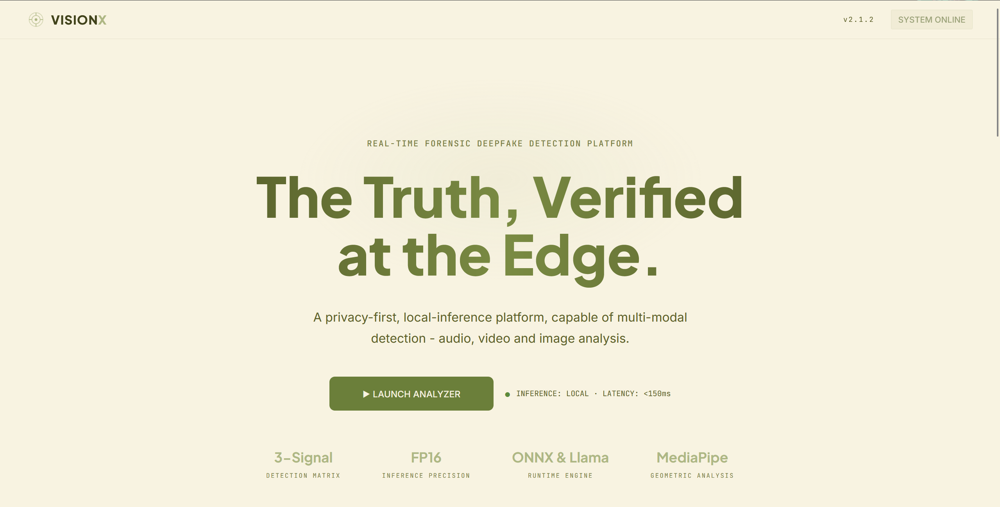
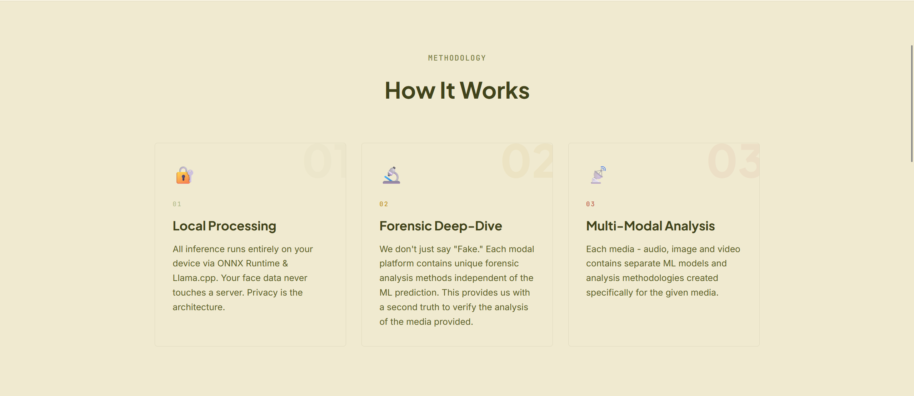
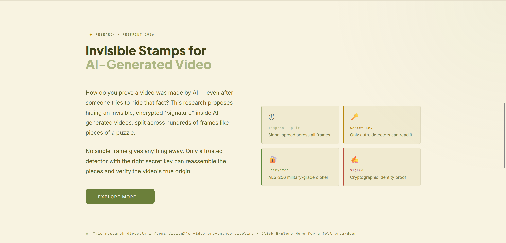
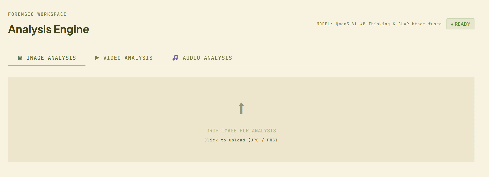
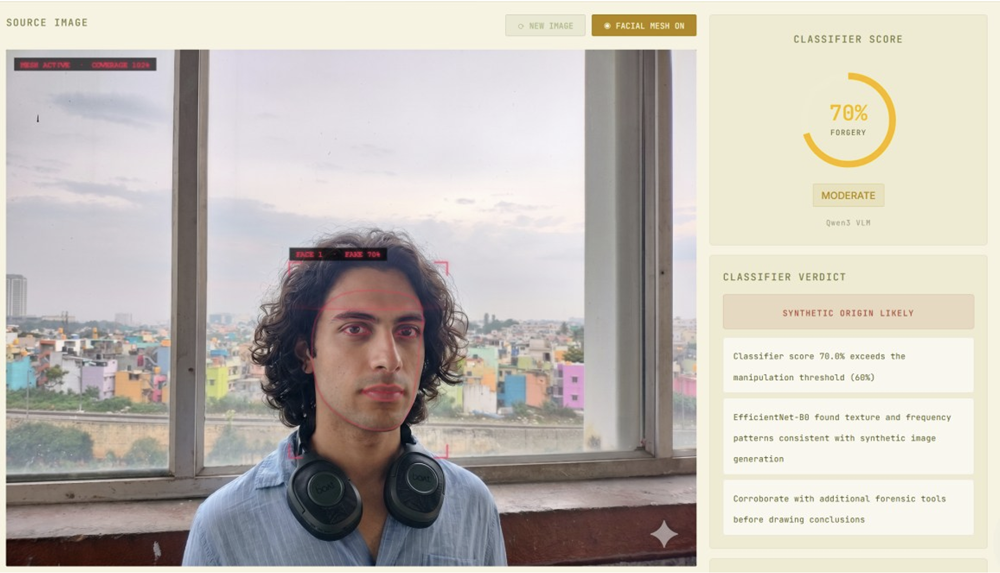
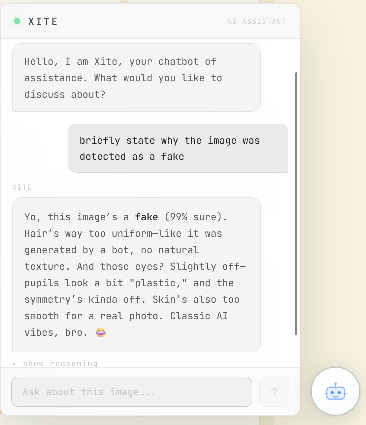
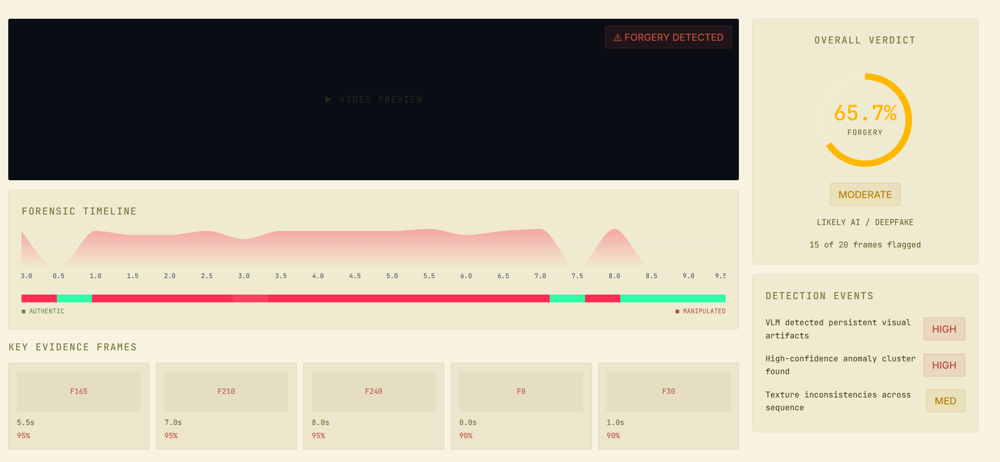
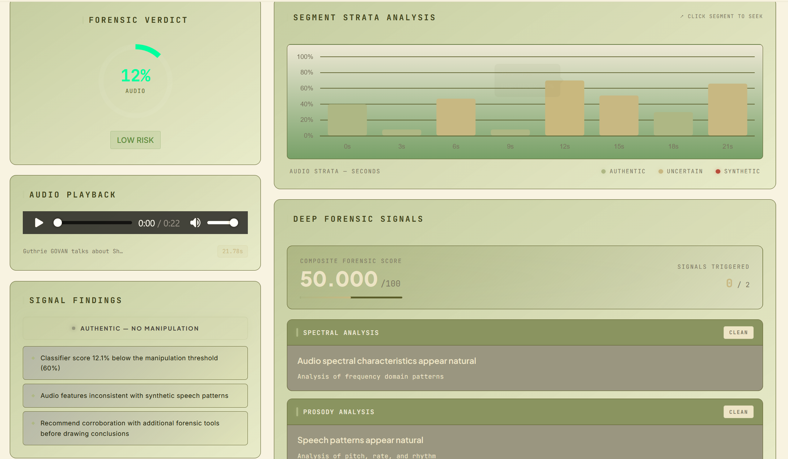

# VisionX
Edge AI Deepfake Detection with a Forensic Dashboard

<b>Note:</b>
All the details are explained in thorough detail in the pdf in assets folder. That report was created because this project was a university semester graded project.

<h2>Project Demo</h2>

<h3>Landing Page</h3>

<h3>How it Works?</h3>

<h3>Watermark Intro</h3>

<h3>Media Tab Navigation</h3>

<h3>Image Mode</h3>

<h3>Xite assistant in Image Mode</h3>

<h3>Video Mode</h3>

<h3>Audio Mode</h3>

